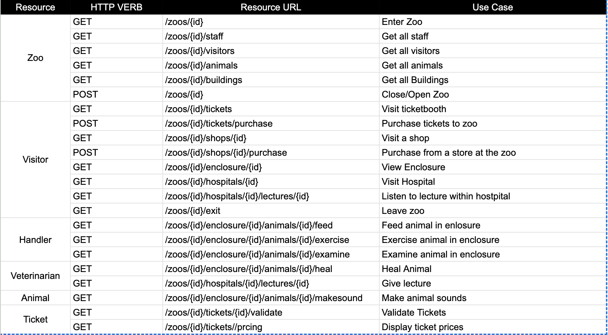

# Zoo API Documentation

## Zoo Endpoints

| HTTP Verb | Resource URL                  | Use Case          |
|-----------|-------------------------------|-------------------|
| GET       | /zoos/{id}                    | Enter Zoo         |
| GET       | /zoos/{id}/staff              | Get all staff     |
| GET       | /zoos/{id}/visitors           | Get all visitors  |
| GET       | /zoos/{id}/animals            | Get all animals   |
| GET       | /zoos/{id}/buildings          | Get all Buildings |
| POST      | /zoos/{id}                    | Close/Open Zoo    |

## Visitor Endpoints

| HTTP Verb | Resource URL                                 | Use Case                      |
|-----------|----------------------------------------------|-------------------------------|
| GET       | /zoos/{id}/tickets                           | Visit ticket booth            |
| POST      | /zoos/{id}/tickets/purchase                  | Purchase tickets to zoo       |
| GET       | /zoos/{id}/shops/{id}                        | Visit a shop                  |
| POST      | /zoos/{id}/shops/{id}/purchase               | Purchase from a store         |
| GET       | /zoos/{id}/enclosure/{id}                    | View enclosure                |
| GET       | /zoos/{id}/hospitals/{id}                    | Visit hospital                |
| GET       | /zoos/{id}/hospitals/{id}/lectures/{id}      | Listen to hospital lecture    |
| GET       | /zoos/{id}/exit                              | Leave zoo                     |

## Handler Endpoints

| HTTP Verb | Resource URL                                         | Use Case                   |
|-----------|------------------------------------------------------|----------------------------|
| GET       | /zoos/{id}/enclosure/{id}/animals/{id}/feed          | Feed animal                |
| GET       | /zoos/{id}/enclosure/{id}/animals/{id}/exercise      | Exercise animal            |
| GET       | /zoos/{id}/enclosure/{id}/animals/{id}/examine       | Examine animal             |

## Veterinarian Endpoints

| HTTP Verb | Resource URL                                         | Use Case                   |
|-----------|------------------------------------------------------|----------------------------|
| GET       | /zoos/{id}/enclosure/{id}/animals/{id}/heal          | Heal animal                |
| GET       | /zoos/{id}/hospitals/{id}/lectures/{id}              | Give lecture               |

## Animal Endpoint

| HTTP Verb | Resource URL                                         | Use Case                   |
|-----------|------------------------------------------------------|----------------------------|
| GET       | /zoos/{id}/enclosure/{id}/animals/{id}/makesound     | Make animal sounds         |

## Ticket Endpoints

| HTTP Verb | Resource URL                                 | Use Case                   |
|-----------|----------------------------------------------|----------------------------|
| GET       | /zoos/{id}/tickets/{id}/validate             | Validate ticket            |
| GET       | /zoos/{id}/tickets/pricing                   | Display ticket prices      |
